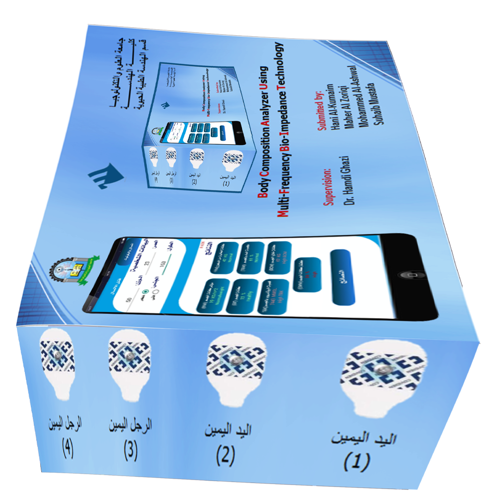
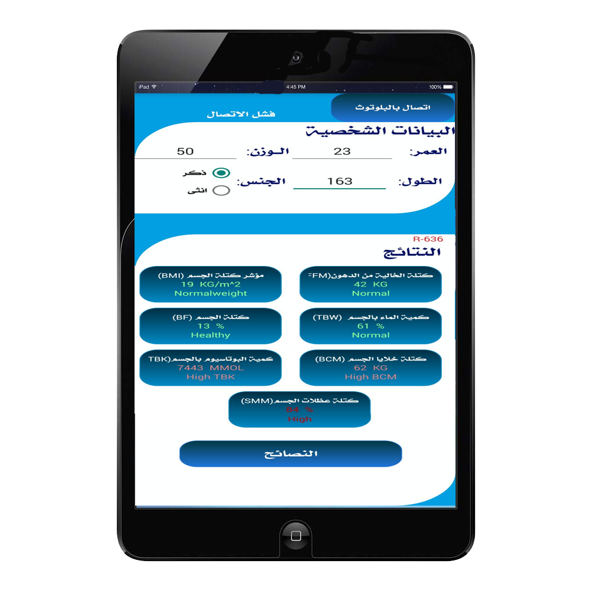

<head >
    <meta charset='utf-8'>
    <meta name='viewport' content='width=device-width'>
    <title>حول التطبيق</title>
    <link href="fontawesome/css/all.css" rel="stylesheet"> <!--load all styles -->

    

</head>
    <body style="direction: rtl;dir="rtl"; font-family: 'Helvetica Neue', Helvetica, Arial, sans-serif; padding:1em ">
    <h1>
    حول التطبيق
    </h1>
        قمتا بعمل هذا الجهاز   SMART BODY coPosition analyzer  والذي يتضمن هذا البرنامج لعرض المتغيرات
        المقاسة عبر الدائرة الالكترونية حيث نقدم هذا المشروع لجامعة العلوم والتكنولوجيا والذي يقوم بقياس

  <ul>
      <li>كمية الكتلة الخالية من الدهون  (Free Fat Mass)</li>
      <li>نسبة الدهون في الجسم(Percent Body Fat)  </li>
      <li>ومؤشر كتلة الجسم (Body Mass Index)</li>
      <li>الكتلة الكلية للخلايا (Body Cell Mass) </li>
      <li>كمية الماء الكلية في الجسم  (Total Body Water)  </li>
      <li>الكتلة العضلاتفي الجسم  (Skeletal Muscle Mass)</li>
      <li>كمية البوتاسيوم في الجسم  (Total Body Potassium)</li>

  </ul>

     ولا يعمل هذا التطبيق الى مع وجود الجزء الالكتروني حيث يتضمن الإلكترودات لاصقة حيث وضع هذه الأقطاب بشكل عرضي على مسار التيار الكهربائي في الرسغ والكاحل من نفس الجانب من الجسم لليد واثنان في مشط القدم والرسغ  على التوالي  من الجهة اليمنى للجسم  ويتم توصيل البرنامج بالجهاز عبر البلوتوث الذي ينقل المتغيرات المقاسة ويتم ادخال الوزن والطول والعمر والجنس عبر البرنامج ليتم قياس وعرض المكونات الجسم المذكورة سابقا مع عرض التشخيص والنصائح المتبعة في حالة الغير طبيعية لمساعدة في معالجة المريض ومراقبة الحالة الصحية للمريض ويستخدم الجهاز للبالغين وجهازنا يساعدك على تتبع صحتك وسهل الاستخدام للمرضى وقليل التكلفة نسعى دائما للحفاض على صحتكم .

# فريق العمل
        طلاب جامعة العلوم والتكنلوجيا كلية الهندسة قسم الهندسة الطبية الحيوية
    <ul>  <li> هاني فايز صالح الكميم  </li>
    <li>محمد يحيى يحيى الاشول </li>
    <li>ماهر احمد احمد الزريقي </li>
    <li>صهيب مصطفى اسماعيل القدسي  </li></ul>
# اشراف
        رئيس قسم الهندسة الطبية الحيوية
    

    <ul>  <li> د. حمدي  غازي </li></ul>
    <strong>
    مبرمج التطبيق 
    </strong>
    

        مبرمج تطبيقات اندرويد بلغة java و flutter ومطور مواقع اللكترونية بلغة python أطار عمل django
    

    

        خريج بكلاريوس تقنية معلومات
    

    <ul>
    <li>
    م.ابراهيم شاهر الزريقي 
    </li>
    </ul>

    

    
<strong>اتصل بنا</strong>
    

    

         لتواصل مع مبرمج التطبيق
    

          <i class="fas fa-mail-bulk"></i>

          <a href="mailto: ialzoriqi@gmail.com"  target="_blank">ialzoriqi@gmail.com</a>

         
    <i class="fab fa-facebook"></i>

    <a href="https://www.facebook.com/IbrahimAlzoriqi"  target="_blank">@IbrahimAlzoriqi</a>
    <!-- uses regular style -->
     

    <i class="fab fa-twitter"></i>

    <a href="https://www.twitter.com/IAlzoriqi"  target="_blank">@IAlzoriqi</a>
    <!-- uses regular style -->
     
    <i class="fab fa-telegram"></i>
    <a href="https://t.me/IAlzoriqi"  target="_blank"> @IAlzoriqi </a>

     
        <i class="fab fa-whatsapp"></i> <!-- uses brands style -->
        <a href="https://wa.me/+967772703145"  target="_blank"> +967772703145  </a>
         
        <!--brand icon-->
    <i class="fab fa-github-square"></i> <!-- uses brands style -->
        <a href="https://github.com/IAlzoriqi"  target="_blank"> @IAlzoriqi  </a>

         

    

    

    
    

    

    </body>
    </body>
    </html>
